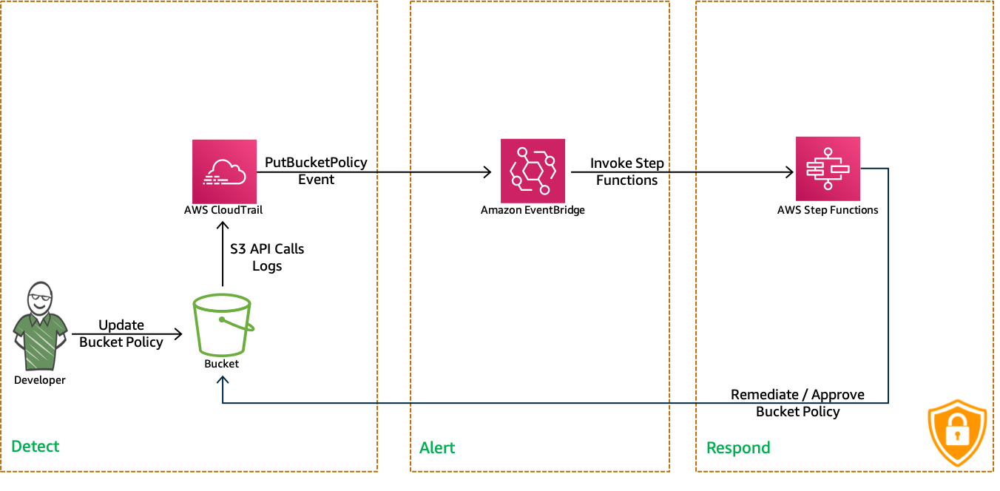

# AWS Security Automation: Remediate Weak S3 Bucket Policies

Amazon S3 has become the quintessential object storage mechanism for lot of businessess. But weak S3 policies have been the bane of [many](https://www.engadget.com/2018/08/09/amazon-aws-error-exposes-31-000-godaddy-servers) [many](https://www.skyhighnetworks.com/cloud-security-blog/verizon-data-breach-two-easy-steps-to-prevent-aws-s3-leaks/) [businesses](https://businessinsights.bitdefender.com/worst-amazon-breaches). 

Ever wondered how to solve this problem and do this efficiently at cloud scale?

- What if, you can automatically validate any changes to S3 Bucket policies?
- What if, you can automatically approve the change if it is compliant to security standards?
- What if, you can revoke the change change and notify SecOps if it is non compliant?

    That is exactly what we are going to do right now using, `AWS CloudTrail`, `AWS EventBridge`, `AWS StepFunctions` and`AWS Config`.

  

  Follow this article in **[Youtube](https://youtu.be/a4gOXBrVe6w)**

  For every `PutBucketPolicy` event, we will check if the `Principal` is `*` and `Effect` is `Allow`. If it is the case, we remove this policy statement and restore the previous bucket policy from AWS Config.

1. ## Prerequisites

    This demo, instructions, scripts and cloudformation template is designed to be run in `us-east-1`. With few modifications you can try it out in other regions as well(_Not covered here_).

    - AWS CLI pre-configured - [Get help here](https://youtu.be/TPyyfmQte0U)
    - AWS Config must be enabled and recording
    - **Optional** AWS CDK Installed & Configured - [Get help here](https://www.youtube.com/watch?v=MKwxpszw0Rc)

1. ## Environment Setup

    In this repo, I have included a cloudformation template that provisions the resources to setup a fully automatic policy remedation engine.

    - **S3 Bucket**: We will use this bucket to modify its policy
    - **Cloudtrail(regional)**: Monitor all S3 Put API Events
    - **StepFunction**:
        - Evaluate new bucket policy compliance
        - If `NON COMPLIANT` retrieve previous bucket policy from AWS Config
        - Restore previous bucket policy
    - **EventBridge Rule**: Receives `PutBucketPolicy` events & triggers stepfuction
    - All the necessary IAM Role and necessary permissions

    _**Note**: Sample bucket policies to test the solution can be found in the output section of the cloudformation template_

1. ## Deployment

  You have couple of options to set this up in your account, You can use [AWS CDK](https://www.youtube.com/watch?v=MKwxpszw0Rc) or use the cloudformation template generated by CDK. All the necessary steps are baked into the templates, you can launch it and try it out.

  1. ### Method 1: Using AWS CDK

      If you have AWS CDK installed you can close this repository and deploy the stack with,

        ```sh
        git clone https://github.com/miztiik/security-automation-remediate-weak-s3-policy.git
        cd security-automation-remediate-weak-s3-policy
        source .env/bin/activate
        ```

      The very first time you deploy an AWS CDK app into an environment _(account/region)_, you’ll need to install a `bootstrap stack`, Otherwise just go aheadand   deploy using `cdk deploy`

        ```sh
        cdk bootstrap
        cdk deploy
        ```

  1. ### Method 2: Using AWS CloudFormation

      Look for the cloudformation template here: `cdk.out` directory, _From the CLI,_

        ```sh
        aws cloudformation deploy \
                --template-file ./cdk.out/security-automation-remediate-weak-s3-policy.json \
                --stack-name "MiztiikAutomationStack" \
                --capabilities CAPABILITY_IAM
        ```

1. ## Testing the solution

    In the `Ouputs` section of the cloudformation template we have,

    - `S3 bucket` link for updating policy,
    - `SampleWeakS3Policy`
    - `sampleRestrictiveS3Policy`

    This is what, we are going to do now,

    1. Add the `sampleRestrictiveS3Policy` to the `S3 Bucket` - Check the state function execution results - It should evaluate successfully and permits the use of this policy.
    1. Now add the `SampleWeakS3Policy` - Wait for the state function to complete its evaluation, We should see the policy being `NON COMPLIANT` and reverts back to the `sampleRestrictiveS3Policy`

    **NOTE: Be careful not to set off an infinite step function loop. As every lambda remediation with previous policy will trigger `PutBucketPolicy` event. 
    if you happen to have `NON COMPLIANT` policies in existing buckets and try to add another `NON COMPLIANT` policy, you will set off an infinite loop. You can restrict `EventBridge` to trigger only for bucket of your interest too**

    _If you happen to set it off, one easy way to break the loop is to `DISABLE` the event rule, until you fix your non compliances.

    Now that we have confirmed the solution is working, you can extend the solution as required.

1. ## Next Steps: Do Try This

    - Trigger notification to InfoSec team for every weak policy evaluated
    - Qurantine User/Role attempting multiple times

1. ## CleanUp

    If you want to destroy all the resources created by the stack, Execute the below command to delete the stack, or _you can delete the stack from console as well_

    1. Delete CloudTrail S3 Buckets - as required,
        - The bucket names begin with:  `security-automation-remed*`
    1. Delete CloudWatch Lambda LogGroups
    1. Disable `AWS Config` - as required
    1. Delete the stack[s],

    ```bash
    # Delete the CF Stack
    aws cloudformation delete-stack \
        --stack-name "MiztiikAutomationStack" \
        --region "${AWS_REGION}"
    ```

    This is not an exhaustive list, please carry out other necessary steps as maybe applicable to your needs.

## Buy me a coffee

Buy me a coffee ☕ here `https://paypal.me/valaxy`, _or_ You can reach out to get more details through [here](https://youtube.com/c/valaxytechnologies/about).

### References

1. [Controlling Access to S3 Resources](https://aws.amazon.com/blogs/security/iam-policies-and-bucket-policies-and-acls-oh-my-controlling-access-to-s3-resources/)
1. [Bucket Policy Examples](https://docs.aws.amazon.com/AmazonS3/latest/dev//example-bucket-policies.html)
1. [Configure a CloudWatch events rule for GuardDuty](https://aws.amazon.com/premiumsupport/knowledge-center/guardduty-cloudwatch-sns-rule/)

### Metadata

**Level**: 400
